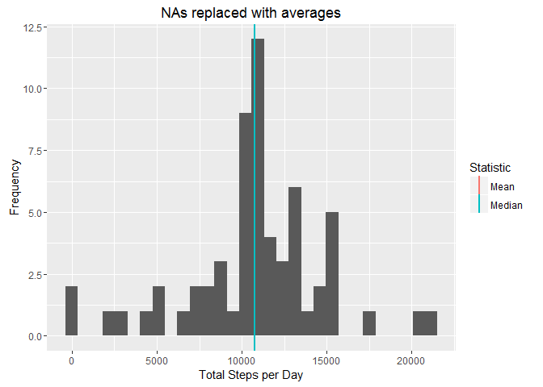

# Reproducible Research: Peer Assessment 1

## Summary


## Loading and preprocessing the data
Let's read the data from the file 'activity.csv' inside the zip-file 'activity.zip'.


```r
con <- unz("activity.zip", "activity.csv")
activity <- read.csv(con, colClasses = c("integer", "Date", "integer"))
```


## What is mean total number of steps taken per day?
Note that we ignore the missing values in the data set. 

First we calculate the total number of steps for each day in the data set.

```r
totalPerDay <- with(activity, 
         tapply(steps, date, sum, na.rm = T))
```
We make a histogram of the total number of steps per day. We also add the mean and median.


```r
st <- data.frame(Statistic = c("Mean", "Median"), 
                 val = c(mean(totalPerDay), median(totalPerDay)))

library(ggplot2)
qplot(totalPerDay, 
      geom="histogram",
      main = "Histogram of Total Steps per Day",
      xlab = "Total Steps per Day", 
      ylab="Frequency") +
    geom_vline(data=st, 
               aes(xintercept = val, col=Statistic), lwd=1)
```

```
## `stat_bin()` using `bins = 30`. Pick better value with `binwidth`.
```

<!-- -->

For completeness we also present the mean and median numerically.

```r
paste0("The mean is ", mean(totalPerDay), " and the median is ", median(totalPerDay))
```

```
## [1] "The mean is 9354.22950819672 and the median is 10395"
```

## What is the average daily activity pattern?
Now we want to find patterns in the activity level depending on the time of day, i.e. the interval variable. 

We plot the average daily activiy for each 5 minute interval in the data set. I.e. for each 5 minute time interval (x-axis) we plot the average number of steps averaged over all days. 


```r
averageDaily <- with(activity, tapply(steps, interval, mean, na.rm=T))
# Convert to data frame
averageDaily <- data.frame(interval = as.integer(names(averageDaily)),
                           average = averageDaily)
# Plot
qplot(interval, average, data = averageDaily, geom="line") + 
    xlab("5 Minute Time Interval") + ylab("Average Number of Steps")
```

<!-- -->

Next we calculate where the maximum value is attained. 

```r
# Calcuate maximum interval
maxInterval <- averageDaily[averageDaily$average == max(averageDaily$average), "interval"]
print(paste0("Max time interval = ", maxInterval))
```

```
## [1] "Max time interval = 835"
```
In other words, the user's average activity level is peaking around 0835 hours. Maybe a morning jog or walking to work?

## Imputing missing values
We will now deal with the missing values in the data set. First we calculate the number of NAs.

```r
sum(sapply(activity$steps, is.na))
```

```
## [1] 2304
```
We are going to replace the NA values with the average of that time inveral. 

```r
# Merge by interval
imputed <- merge(activity, averageDaily)
# Convert steps to numeric
imputed$steps = as.numeric(imputed$steps)
# Fill in average for NA
for(i in 1:nrow(imputed)) {
    if(is.na(imputed[i,"steps"])) {
        imputed[i, "steps"] <- imputed[i, "average"]
    }
}
```
Now we plot a histogram of the imputed data.

```r
totalPerDay <- with(imputed, 
         tapply(steps, date, sum, na.rm = T))
st <- data.frame(Statistic = c("Mean", "Median"), 
                 val = c(mean(totalPerDay), median(totalPerDay)))

qplot(totalPerDay, 
      geom="histogram",
      main = "NAs replaced with averages",
      xlab = "Total Steps per Day", 
      ylab="Frequency") +
    geom_vline(data=st, 
               aes(xintercept = val, col=Statistic), lwd=1)
```

```
## `stat_bin()` using `bins = 30`. Pick better value with `binwidth`.
```

<!-- -->

Note that the mean and median are given by:


```r
paste0("Mean = ", mean(totalPerDay), " Median = ", median(totalPerDay))
```

```
## [1] "Mean = 10766.1886792453 Median = 10766.1886792453"
```

Note that the mean and median now coincides! And it makes sense that imputing the data with averages should move the data set towards the average.  

## Are there differences in activity patterns between weekdays and weekends?
We will now investigate how the activity level varies between weekdays and weekends. Since most people have different routines when they don't have work we expect the activity levels to be different.

We add a factor variable to the data set signifying if the date is a weekday or weekend. Then we plot a time series for each factor value.

```r
# Force English locale to get weekday names right
Sys.setlocale("LC_ALL","English")
```

```
## [1] "LC_COLLATE=English_United States.1252;LC_CTYPE=English_United States.1252;LC_MONETARY=English_United States.1252;LC_NUMERIC=C;LC_TIME=English_United States.1252"
```

```r
isWeekend <- weekdays(imputed$date) %in% c("Saturday", "Sunday")
imputed$dayOfWeek[isWeekend] <-  "weekend"
imputed$dayOfWeek[!isWeekend] <-  "weekday"

# Compute average per interval and day of week
a <- aggregate(imputed$steps, by=imputed[c("interval", "dayOfWeek")],
                     FUN=mean)

qplot(interval, x, data=a, geom="line", facets = dayOfWeek ~ .)
```

<!-- -->

We see in the plot above that there is a significant difference in activity patterns between weekdays and weekends. 
